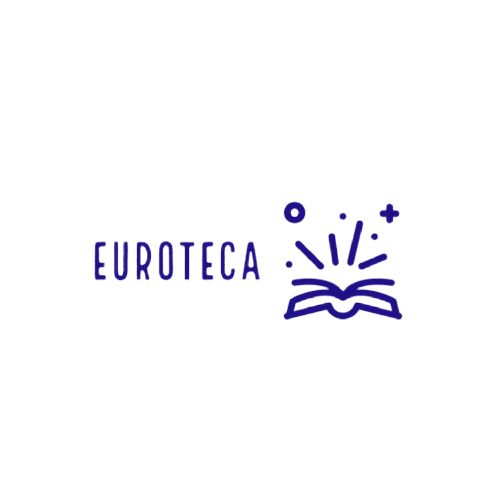

## Sumário
- [Descrição](#descrição)
- [Mostrando o programa](#mostrandooprograma)
- [Contato](#contato)

## Descrição
A ideia surgiu como um projeto de TCC do curso tecnico em desenvolvimento de sistemas, a ideia foi criar uma plataforma que auxilia a biblioteca, no qual reúne um vasto acervo de livros, com milhares de títulos técnicos, acadêmicos e científicos, o objetivo é facilitar a interação escola e aluno, dar um upgrade nas tarefas realizadas pelo bibliotecário, que explanou as dificuldades com o programa atual, dando assim o gatilho a um futuro projeto.

Isso facilitará e auxiliará a busca de exemplares disponíveis na biblioteca, como também o aluguel dos mesmos. O ponto de partida do projeto deu-se por meio de pesquisas realizadas com alunos, que apontaram para a demora em fila para alugar um exemplar. Desse modo, elaboramos uma ferramenta para agilizar o atendimento e levar os alunos a terem uma experiência mais dinâmica.

## Mostrando o programa
Neste video eu mostro como é usado o programa, suas funcionalidades e sua interface.
https://www.loom.com/share/ef4915db26ad4de1a5f34d4d2ef15893?sid=20cdbbf9-a67a-412a-a346-7907d2e26425

caso o video não esteja funcionando, clique no icone abaixo e baixe o video:

## Contato
Caio Eduardo - @scaioeduardoss - caioeduardo20147@gmail.com

Link do Projeto: https://github.com/caioeduardoss/euroteca
